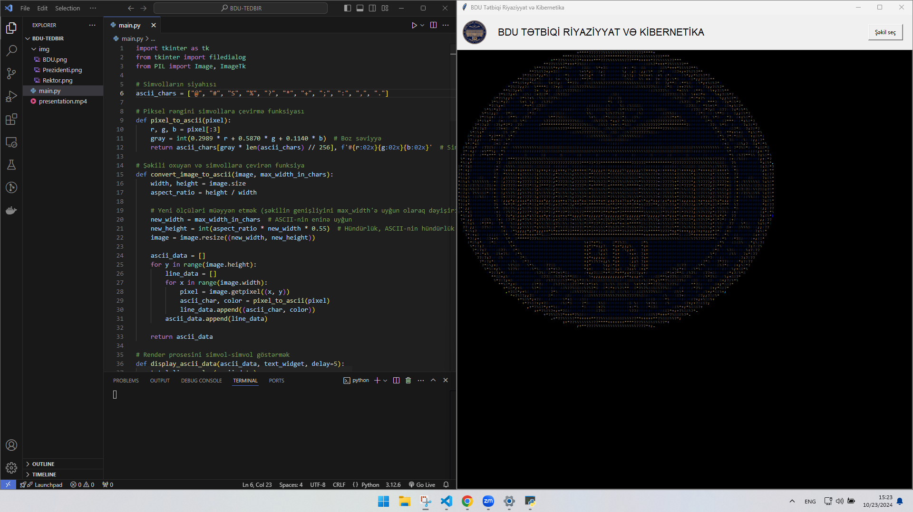

# BDU-nun 105 İllik Yubileyinə Həsr Olunmuş ASCII Art Tətbiqi

Bu tətbiq Bakı Dövlət Universitetinin (BDU) 105 illik yubileyinə həsr edilmişdir və tədbirdə nümayiş olunacaq şəkillərin ASCII formatında vizualizasiyasını təmin edir. Proqram müxtəlif şəkilləri ASCII simvolları ilə göstərərək onları rəngli və interaktiv formatda təqdim edir.

## Məzmun

- [Xüsusiyyətlər](#xüsusiyyətlər)
- [Quraşdırma](#quraşdırma)
  - [Tələblər](#tələblər)
  - [Python Quraşdırılması](#python-quraşdırılması)
  - [Kitabxanaların Quraşdırılması](#kitabxanaların-quraşdırılması)
- [İstifadə](#istifadə)
  - [Proqramın İşlədilməsi](#proqramın-işlədilməsi)
  - [İstifadəçi İnterfeysi](#istifadəçi-interfeysi)
- [Funksional Xüsusiyyətlər](#funksional-xüsusiyyətlər)
- [Ekran Görüntüləri](#ekran-görüntüləri)
- [Töhfə Vermə](#töhfə-vermə)
- [Lisenziya](#lisenziya)
- [Əlaqə](#əlaqə)

## Xüsusiyyətlər

- **ASCII Vizualizasiya**: Şəkilləri ASCII simvollarına çevirərək unikal bir təqdimat formatı təklif edir.
- **Rəngli Göstəriş**: Rəngli vizuallaşdırma ilə şəkillərin detalları qorunur.
- **İnteraktiv Seçimlər**: İstifadəçilər öz şəkillərini seçərək onları ASCII formatında göstərə bilərlər.
- **İstifadəçi Dostu İnterfeys**: Sadə və intuitiv istifadəçi interfeysi ilə rahatlıq təmin edilir.

## Ekran Görüntüləri və Video

Proqramın iş prinsiplərini əyani göstərmək üçün aşağıda nümunə ekran görüntüləri və video verilmişdir.

### Ekran Görüntüləri

**Şəkil yükləmə və ASCII simvolları ilə vizuallaşdırma:**

### Video Demo

Proqramın iş prinsipi üzrə demo videosuna aşağıdan baxa bilərsiniz:

> Yuxarıdakı bağlantı `presentation/presentation.mp4` faylını işarə edir. Faylın düzgün yerləşdiyindən əmin olun.

## Quraşdırma

### Tələblər

- **Python 3.x**
- **tkinter** kitabxanası (Python ilə birlikdə gəlir)
- **Pillow** kitabxanası (`pip` vasitəsilə quraşdırıla bilər)

### Python Quraşdırılması

#### Windows

1. [Python rəsmi saytından](https://www.python.org/downloads/windows/) Python quraşdırıcısını yükləyin.
2. Quraşdırıcıyı işə salın və "Add Python to PATH" seçimini qeyd etməyi unutmayın.
3. Komanda sətrində `python --version` yazaraq quraşdırmanın düzgün olduğunu yoxlayın.

#### macOS

1. Terminalda Homebrew vasitəsilə Python-u quraşdırın:
   brew install python
Əgər Homebrew quraşdırılmayıbsa, əvvəlcə [Homebrew quraşdırın](https://brew.sh/).

2.  `python3 --version` yazaraq quraşdırmanı yoxlayın.

#### Linux

    enter code here

**Debian/Ubuntu əsaslı sistemlər üçün:**

	sudo apt update
	sudo apt install python3` 

**Fedora/RHEL əsaslı sistemlər üçün:**

	sudo dnf install python3

**Arch Linux üçün:**

`sudo pacman -S python` 

### Kitabxanaların Quraşdırılması

`Pillow` və `tkinter` kitabxanalarını quraşdırmaq üçün aşağıdakı addımları izləyin:

**Pillow kitabxanasını quraşdırın:**

`pip install Pillow` 

`tkinter` kitabxanası adətən Python ilə birlikdə gəlir. Əgər quraşdırılmayıbsa:

**Debian/Ubuntu:**

`sudo apt install python3-tk` 

**Fedora/RHEL:**

`sudo dnf install python3-tkinter` 

**Arch Linux:**

`sudo pacman -S tk` 

## İstifadə

### Proqramın İşlədilməsi

**Repozitoriyanı klonlayın:**

	git clone https://github.com/avazalijamal/Photo-Convert-To-ASCII.git
	cd Photo-Convert-To-ASCII

**Lazımi kitabxanaları quraşdırın:**

`pip install Pillow` 

**Proqramı işə salın:**

`python main.py` 

### İstifadəçi İnterfeysi

-   **Loqo Yükləmə**: Proqram açılan kimi BDU loqosu ASCII formatında göstəriləcək.
-   **Şəkil Seçimi**: "Şəkil seç" düyməsinə klikləyərək öz şəkilinizi seçə bilərsiniz.
-   **Vizualizasiya**: Seçilmiş şəkil rəngli ASCII simvollarla vizuallaşdırılacaq.

## Funksional Xüsusiyyətlər

-   `pixel_to_ascii(pixel)`: Piksel rəngini uyğun ASCII simvoluna və rəng koduna çevirir.
-   `convert_image_to_ascii(image, max_width_in_chars)`: Şəkili müəyyən edilmiş genişliyə uyğun olaraq ASCII formatına çevirir.
-   `display_ascii_data(ascii_data, text_widget, delay=5)`: ASCII məlumatlarını sətir-sətir göstərir.
-   `visualize_logo()`: Proqram açıldıqda BDU loqosunu göstərir.
-   `select_image()`: İstifadəçinin seçdiyi şəkili ASCII formatında göstərir.

## Töhfə Vermə

Tətbiqin inkişafına töhfə vermək istəyirsinizsə, fork edin və pull request göndərin. Hər hansı bir sualınız və ya təklifiniz varsa, əlaqə saxlamaqdan çəkinməyin.

## Lisenziya

Bu layihə MIT Lisenziyası altında lisenziyalaşdırılmışdır. Daha ətraflı məlumat üçün LICENSE faylına baxın.

## Əlaqə

-   **Müəllif**: Avaz Əliyev
-   **Email**: avazalijamal@gmail.com
-   **Telefon**: (+994) 50 323-22-96
-   **YouTube Kanalı**: [HEWart TV](https://youtube.com/c/HEWartTV)
